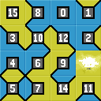
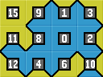

Trabajo Práctico de Programación Funcional
==========================================

Para ejecutar (versión sin edge):
=================================
    gchi TeselasWang.hs
    solveTiles n m t0 t1 t2 t3 t4 t5 t6 t7 t8 t9 t10 t11 t12 t13 t14 t15 seed

Para ejecutar (versión con edge):
=================================
    gchi TeselasWang-edge.hs
    solveTiles n m t0 t1 t2 t3 t4 t5 t6 t7 t8 t9 t10 t11 t12 t13 t14 t15 seed edge

En donde:
---------
    n = cantidad de filas de la superficie a teselar
    m = cantidad de columnas de la superficie a teselar
    t0 - t15 = cantidad de teselas de cada tipo
    seed = tesela inicial que se posicionará en 0,0
    edge = Borde: 0 = Borde Celeste / 1 = Borde Amarillo

Ejemplo (sin edge):
-------------------
    solveTiles 4 4 1 1 1 1 1 1 1 1 1 1 1 1 1 1 1 1 15

    La superficie a teselar es de 4x4
    La bolsa de teselas tiene 16 teselas, una de cada tipo
    La tesela inicial es la 15

Resultado:
----------
    [[1,1,1,1],[1,0,0,0],[0,0,0,0],[0,0,0,1],[0,0,1,1],[1,0,1,0],[1,1,0,0],[0,0,1,0],[0,1,0,0],[0,1,1,0],[1,0,0,1],[9,9,9,9],[0,1,0,1],[0,1,1,1],[1,1,1,0],[1,0,1,1]]

Para ver el resultado con el numero (indice) de cada tesela:
------------------------------------------------------------

    map getTileIndex (solveTiles 4 4 1 1 1 1 1 1 1 1 1 1 1 1 1 1 1 1 15)

Resultado:
----------

    [15,8,0,1,3,10,12,2,4,6,9,135,5,7,14,11]
    

Ejemplo (con edge):
-------------------
    solveTiles 3 4 1 1 1 1 1 1 1 1 1 1 1 1 1 1 1 1 15 1

    La superficie a teselar es de 4x4
    La bolsa de teselas tiene 16 teselas, una de cada tipo
    La tesela inicial es la 15
    El borde es amarillo

Resultado:
----------
    [[1,1,1,1],[1,0,0,1],[0,0,0,1],[0,0,1,1],[1,0,1,1],[1,0,0,0],[0,0,0,0],[0,0,1,0],[1,1,0,0],[0,1,0,0],[0,1,1,0],[1,0,1,0]]

Para ver el resultado con el numero (indice) de cada tesela:
------------------------------------------------------------

    map getTileIndex (solveTiles 3 4 1 1 1 1 1 1 1 1 1 1 1 1 1 1 1 1 15 1)

Resultado:
----------

    [15,9,1,3,11,8,0,2,12,4,6,10]
    

    

Créditos:
- Joaquin Beck
- Carlos Cortés
- Gabriela Rivero
- Leandro Flaschka
- Pablo Provasi
